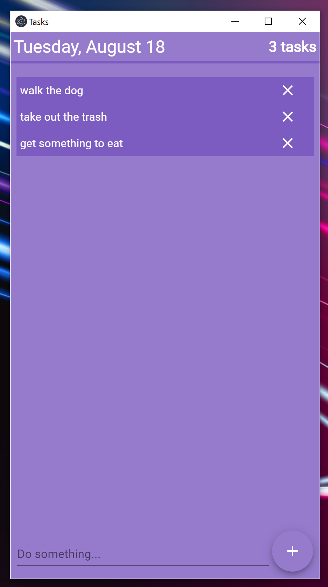

# React-MaterialUI-Eelectron-Tasks-App

This serves as a good app for people learning React and Material UI who might also look into Electron integration. I have this app made for MY preferences, but it is highly customizable. 

Here is what it looks like:

